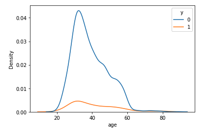
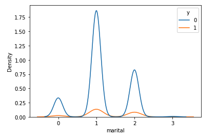

# Comparing Classifiers Analysis on Portugese Bank customers dataset

Analysis of what features will drive users to go for term deposit.

## Dataset - Portugese Bank Data 
## Classifiers used for analysis - k-nearest neighbors, logistic regression, decision trees, and support vector machines'

## Summary of the observations
######  These features were identifyied as top features of customers who opt for term deposit
###### age
###### job
###### maritial status
###### education
###### pdays - frequency of customer contact 

#### Out of the key features Age and Marital status, as seen in the above graphs 
##### Customers in age group of 20-40 opt more for term deposit.
##### Married (1) and single (2) customers opt more for term deposit than divorced (3)

## Link to the the workbook.
https://github.com/ajswal/aiml-exercises/blob/main/Module_17/comparing_classifiers.ipynb

